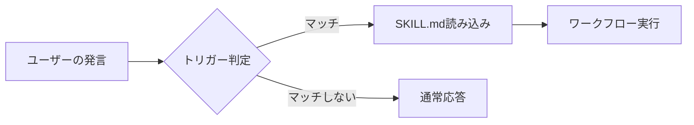
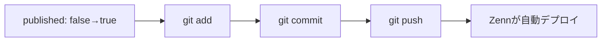
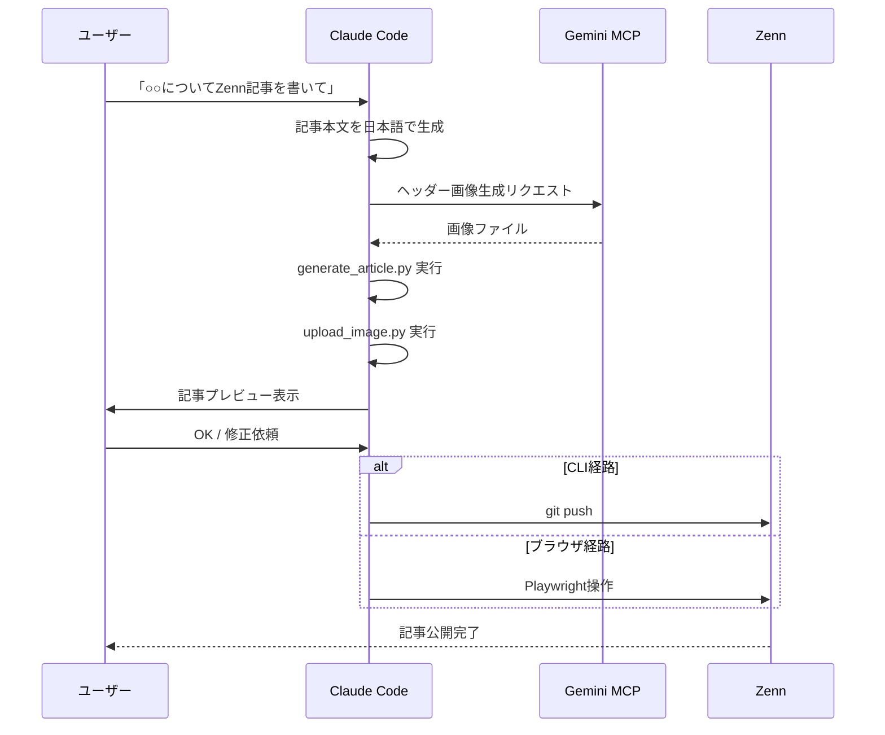

## はじめに

「Zennに記事を書いて」と一言伝えるだけで、AIが技術記事を自動生成し、公開まで完了する――そんな仕組みを **Claude Code** の **Skills** 機能で実現しました。

この記事では、Claude Codeのスキルとして「Zenn記事自動生成・公開スキル」を作った過程と、そのアーキテクチャを解説します。

:::message
この記事で紹介するスキルは、Claude Codeの `~/.claude/skills/` に配置するグローバルスキルです。
:::

## Claude Code Skills とは？

Claude Code Skills は、Claude Code（Anthropic公式CLI）に**カスタムの能力を追加する仕組み**です。`SKILL.md` ファイルにトリガー条件・手順・使用するツールを記述することで、特定のリクエストに対してClaudeが専門的なワークフローを自動実行します。



### スキルの配置場所

| 場所 | 範囲 |
|------|------|
| `~/.claude/skills/` | グローバル（全プロジェクト共通） |
| `.claude/skills/` | プロジェクトローカル |

## Zenn記事自動生成スキルの全体像

### やりたいこと

1. 「Zennに○○の記事を書いて」と伝える
2. Claudeが技術記事を日本語で生成
3. 画像を自動生成・配置
4. Zennに下書きまたは公開

### 課題：ZennにはAPIがない

Zennには記事投稿用のREST APIがありません。そこで**2つの経路**を実装しました。

| 経路 | 方法 | 前提条件 |
|------|------|---------|
| CLI経路 | GitHub連携リポジトリに `git push` | Zenn CLIリポジトリ |
| ブラウザ経路 | Playwrightでダッシュボードを操作 | ログインセッション |

## ディレクトリ構成

```
~/.claude/skills/zenn-article-creator/
├── SKILL.md                         # スキル定義
├── CLAUDE.md                        # 開発ドキュメント
├── scripts/
│   ├── save_login_session.py        # セッション保存
│   ├── generate_article.py          # 記事ファイル生成
│   ├── upload_image.py              # 画像アップロード
│   ├── publish_article.py           # CLI公開 (git push)
│   └── publish_via_browser.py       # ブラウザ公開
├── references/
│   └── zenn-markdown-guide.md       # Zenn記法リファレンス
└── assets/
    └── article-template.md          # テンプレート
```

## 各スクリプトの解説

### 1. `generate_article.py` - 記事ファイル生成

Zennの記事はYAML frontmatter付きのマークダウンファイルです。このスクリプトは、タイトル・emoji・トピックなどを受け取り、正しい形式で `articles/{slug}.md` を生成します。

```python:generate_article.py
def generate_slug(title: str, max_length: int = 50) -> str:
    """タイトルからslugを生成する (日付+ハッシュ、12-50文字)"""
    date_str = datetime.now().strftime("%Y%m%d")
    title_hash = hashlib.md5(title.encode()).hexdigest()[:8]

    ascii_part = re.sub(r"[^a-z0-9]", "-", title.lower())
    ascii_part = re.sub(r"-+", "-", ascii_part).strip("-")

    if ascii_part and len(ascii_part) > 4:
        slug = f"{date_str}-{ascii_part}"
    else:
        slug = f"{date_str}-{title_hash}"

    # 12-50文字に収める
    if len(slug) > max_length:
        slug = slug[:max_length]
    return slug
```

:::message
Zennのslugルールは厳格です。`a-z0-9`・ハイフン・アンダースコアのみ、**12〜50文字**という制約があります。日本語タイトルの場合は日付+ハッシュにフォールバックします。
:::

生成されるファイルの例：

```yaml:articles/20260224-b108f089.md
---
title: "Claude Codeで技術ブログを自動投稿する"
emoji: "🤖"
type: "tech"
topics: ["claudecode", "python", "zenn", "自動化"]
published: false
---
```

#### 使い方

```bash
python generate_article.py \
  --title "記事タイトル" \
  --emoji "🚀" \
  --type tech \
  --topics python zenn automation \
  --body-file /tmp/body.md \
  --output-dir ~/zenn-repo/articles
```

### 2. `save_login_session.py` - ログインセッション保存

ブラウザ経路で公開する場合、事前にZennへのログインセッションを保存する必要があります。

```python:save_login_session.py
def save_session(timeout: int = 120):
    with sync_playwright() as p:
        browser = p.chromium.launch(headless=False)  # 画面あり
        context = browser.new_context()
        page = context.new_page()

        page.goto("https://zenn.dev/enter")

        # ユーザーが手動ログインするのを待機
        page.wait_for_url(
            lambda url: "/dashboard" in url or url == "https://zenn.dev/",
            timeout=timeout * 1000,
        )

        # セッション情報をJSON保存
        session_data = {
            "cookies": context.cookies(),
            "storage_state": context.storage_state(),
        }
        SESSION_FILE.write_text(json.dumps(session_data, indent=2))
```

:::details 動作の流れ
1. Chromiumが**画面ありモード**で起動
2. `zenn.dev/enter` （ログインページ）に遷移
3. ユーザーがGoogleアカウント等で手動ログイン
4. ダッシュボードへのリダイレクトを検出
5. CookieとstorageStateを `.session/zenn-session.json` に保存
:::

### 3. `upload_image.py` - 画像アップロード

画像配置は2つのモードに対応しています。

**ローカルモード**（CLI経路向け）：
```bash
python upload_image.py header.png --mode local --output-dir ~/zenn-repo
# → images/header.png にコピー、/images/header.png を返す
```

**ブラウザモード**（CDNアップロード）：
```bash
python upload_image.py header.png --mode browser
# → Zenn CDNにアップロード、https://storage.googleapis.com/... を返す
```

```python:upload_image.py
def upload_local(image_path: str, output_dir: str | None = None) -> str:
    src = Path(image_path)

    # ファイルサイズチェック (3MB以下)
    size_mb = src.stat().st_size / (1024 * 1024)
    if size_mb > 3:
        print(f"Warning: Zennの制限は3MBです。")

    dest_dir = Path(output_dir or ".") / "images"
    dest_dir.mkdir(parents=True, exist_ok=True)
    shutil.copy2(src, dest_dir / src.name)

    return f"/images/{src.name}"
```

:::message alert
Zennの画像制約：**3MB以下、png/jpg/gifのみ**対応です。
:::

### 4. `publish_article.py` - CLI経路の公開

Zenn CLIリポジトリがGitHubと連携されている場合、`git push` するだけで記事が公開されます。

```python:publish_article.py
def git_publish(article_path: str, commit_message: str | None = None) -> bool:
    path = Path(article_path)

    # frontmatterのpublishedをtrueに変更
    # → git add → git commit → git push
    repo_root = subprocess.run(
        ["git", "rev-parse", "--show-toplevel"],
        capture_output=True, text=True, cwd=str(path.parent),
    ).stdout.strip()

    subprocess.run(["git", "add", str(path)], cwd=repo_root)
    subprocess.run(["git", "commit", "-m", commit_message], cwd=repo_root)
    subprocess.run(["git", "push"], cwd=repo_root)
    return True
```



### 5. `publish_via_browser.py` - ブラウザ経路の公開

CLIリポジトリがない場合は、Playwrightでブラウザを自動操作して記事を公開します。

```python:publish_via_browser.py
def publish_via_browser(article_path: str, headless: bool = False):
    article = parse_article(article_path)

    with sync_playwright() as p:
        browser = p.chromium.launch(headless=headless)
        context = browser.new_context(
            storage_state=session_data["storage_state"]
        )
        page = context.new_page()

        # ダッシュボード → 新規記事 → タイトル入力 → 本文入力
        page.goto("https://zenn.dev/dashboard/new-article")

        # プレビュースクリーンショットを撮影
        page.screenshot(path="/tmp/zenn-screenshots/preview.png")

        # 公開ボタンクリック
        publish_button = page.locator('button:has-text("公開する")')
        publish_button.click()
```

:::details ブラウザ経路のメリット・デメリット
**メリット：**
- GitHubリポジトリ不要
- セットアップが簡単（ログインするだけ）
- プレビュースクリーンショットが撮れる

**デメリット：**
- ZennのUI変更に影響を受ける
- セッションが切れると再ログインが必要
- ヘッドレスモードだと動作が不安定な場合がある
:::

## SKILL.md - スキル定義ファイル

スキルの心臓部である `SKILL.md` には、トリガー条件とワークフロー手順を記述します。

```markdown:SKILL.md
# Zenn記事自動生成・公開スキル

## Triggers
- 「Zennに記事を書いて」「Zenn記事を公開して」
- 「技術ブログを投稿して」
- 「zenn」を含む記事作成依頼

## Instructions

### ワークフロー
1. 記事本文を日本語で生成
2. Gemini MCPで画像生成
3. generate_article.py でファイル生成
4. upload_image.py で画像配置
5. ユーザーに内容確認
6. 公開 (CLI or ブラウザ)
```

ポイントは **Triggersセクション** です。ここに書いたキーワードやフレーズにマッチすると、Claude Codeがこのスキルを自動起動します。

## ワークフロー全体図



## セットアップ方法

### 前提条件

- Python 3.10以上
- Claude Code

### インストール

```bash
# スキルディレクトリを配置
# （すでに ~/.claude/skills/zenn-article-creator/ に配置済み）

# ブラウザ経路を使う場合のみ
pip install playwright
playwright install chromium
```

### CLI経路の場合

```bash
# Zenn CLIリポジトリの初期化
mkdir zenn-repo && cd zenn-repo
npm init --yes
npx zenn init

# GitHubリポジトリと連携
git init
git remote add origin git@github.com:your-name/zenn-content.git
```

:::message
CLI経路ではZennの **GitHub連携** を事前に設定してください。ZennダッシュボードのDeploysページからリポジトリを連携できます。
:::

### ブラウザ経路の場合

```bash
# 初回のみ：ログインセッション保存
python ~/.claude/skills/zenn-article-creator/scripts/save_login_session.py
```

## 使ってみる

Claude Codeを起動して、こう伝えるだけです：

```
「PythonのデコレータについてZennに技術記事を書いて」
```

すると、Claude Codeが：

1. Pythonデコレータについての技術記事を日本語で執筆
2. コード例やZenn固有の `:::message` ブロックを活用
3. 記事ファイルを生成（frontmatter付き）
4. プレビューを表示して確認を求める
5. 承認後、指定した経路で公開

## Zenn固有のマークダウン活用

このスキルは `references/zenn-markdown-guide.md` にZenn記法のリファレンスを内蔵しています。Claudeはこのリファレンスを参照して、Zenn固有の記法を積極活用します。

```markdown
:::message
メッセージブロックで重要な情報を強調
:::

:::details 長いコードの折りたたみ
折りたたまれるコンテンツ
:::

```mermaid（ダイアグラム記法）```
```

## まとめ

Claude Code Skills を使って、**Zenn記事の自動生成・公開パイプライン**を構築しました。

| 機能 | スクリプト |
|------|-----------|
| 記事ファイル生成 | `generate_article.py` |
| セッション管理 | `save_login_session.py` |
| 画像アップロード | `upload_image.py` |
| CLI公開 | `publish_article.py` |
| ブラウザ公開 | `publish_via_browser.py` |

**ポイント：**
- ZennにAPIがないため、CLI（git push）とブラウザ（Playwright）の2経路を実装
- SKILL.mdのトリガー定義で自然言語から自動起動
- Zenn固有のマークダウン記法リファレンスを内蔵
- slug生成・バリデーションをZennルールに準拠

Claude Code Skills は、定型的なワークフローを自動化する強力な仕組みです。ぜひ皆さんも独自のスキルを作ってみてください！

